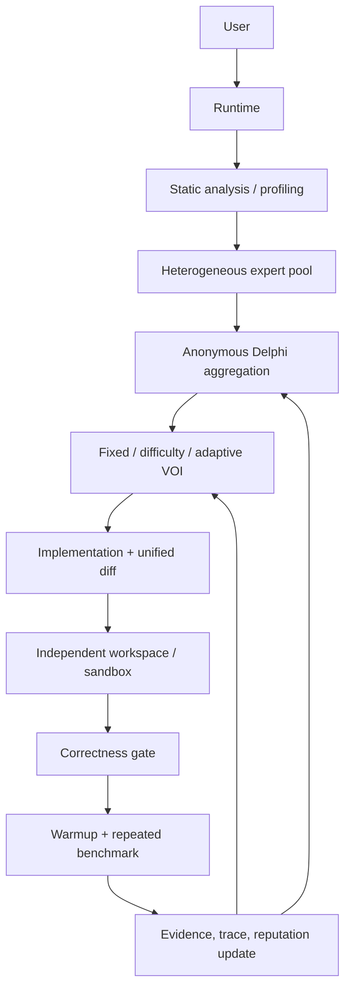

# DelphiOpt

**Adaptive Delphi Multi-Agent Runtime for Budget-Aware Autonomous Code Optimization**

DelphiOpt is a runnable research prototype that turns code optimization into an evidence-driven loop: heterogeneous experts propose independently, anonymous Delphi feedback revises and ranks hypotheses, a scheduler allocates model/token/tool budget, and isolated workspaces accept only patches that preserve correctness and produce repeated benchmark evidence.

> We explore whether independent anonymous feedback and adaptive inference allocation improve verified optimization utility under cost, token, latency, and tool budgets. Results are generated by runs; this repository does not claim state-of-the-art performance.

## Why this is not ordinary multi-agent debate

Round 1 never exposes peer answers. Algorithm, compiler, systems, memory, and skeptic experts analyze the same static evidence independently. From round 2 onward, agents receive anonymous candidate summaries plus observed test/benchmark evidence. A high-upside minority hypothesis can still enter an experiment; consensus is not treated as proof.

## Architecture



Core modules:

* `models.py` — typed proposals, decisions, budgets, benchmark results, summaries.
* `providers.py` — provider-neutral async interface plus Mock, OpenAI, Anthropic, Gemini, and OpenAI-compatible REST providers.
* `agents.py` — structured JSON proposal validation and persona prompts.
* `delphi.py` — independent elicitation, anonymous aggregation, minority preservation, disagreement.
* `scheduler.py` — `fixed`, `difficulty`, and `adaptive_voi` policies with explainable decisions.
* `budget.py` — one global cost/token/latency/LLM/tool/benchmark ledger.
* `optimizer.py` — validated unified-diff application, atomic accepted-file sync, and compile/lint/test gates.
* `benchmark.py` — budgeted warmups, repetitions, memory, throughput, median/mean/stddev/95% interval.
* `runtime.py` — closed-loop orchestration and verified accept/reject decision.
* `telemetry.py` and `reporting.py` — JSONL/SQLite traces and evidence-rich HTML reports; `cli.py` — operational CLI.

## Install

Python 3.11+ is required.

```powershell
cd DelphiOpt
python -m pip install -e ".[dev]"
```

The Mock Provider requires no API key.

## Quick start

```powershell
delphiopt optimize examples/demo_project
# PATH-independent equivalent:
python -m delphiopt optimize examples/demo_project
```

The demo contains an intentionally slow list-membership hot loop. DelphiOpt runs baseline tests and benchmarks, elicits five expert proposals, ranks candidates, applies a set-membership patch in a temporary copy, reruns correctness and repeated performance tests, and copies the patch back only after the evidence gate passes.

Useful commands:

```powershell
delphiopt benchmark examples/demo_project
delphiopt inspect RUN_ID
delphiopt report RUN_ID
delphiopt reproduce RUN_ID
delphiopt models
delphiopt experts
```

`RUN_ID` is printed in the optimization JSON and traces live under `examples/demo_project/.delphiopt/runs/`.

## Configuration

```yaml
models:
  cheap: {provider: mock, model: mock-cheap}
  strong: {provider: mock, model: mock-strong}
experts:
  algorithm: {persona: Algorithm Expert, model_pool: [cheap, strong]}
  skeptic: {persona: Skeptic Agent, model_pool: [strong]}
scheduler: {strategy: adaptive_voi, base_tokens: 900, tool_budget: 2}
collaboration: {mode: delphi}
budget:
  max_cost_usd: 1.0
  max_tokens: 150000
  max_latency_seconds: 900
  max_llm_calls: 30
  max_benchmark_runs: 20
delphi: {max_rounds: 3, meaningful_speedup: 1.05}
benchmark: {warmups: 2, repetitions: 5, timeout_seconds: 120}
sandbox: {type: local, network: false, cpu_limit: 2, memory_mb: 2048}
```

Configuration precedence is defaults → project `delphiopt.yaml` → explicit `--config` → CLI flags. Merge operations deep-copy state, validate positive budgets, reject unknown models, and preserve project test/benchmark commands. Use `--budget-usd`, `--max-rounds`, and `--mode single|debate|delphi` for final overrides. Real providers use `OPENAI_API_KEY`, `ANTHROPIC_API_KEY`, or `GEMINI_API_KEY`; see `configs/real-providers.yaml.example`. Providers return the same `AgentResponse` shape, account for provider-reported token usage, retry invalid structured output once, and keep the runtime provider-neutral.

## Protocol and scheduling

The candidate score uses configurable weights for consensus, expected gain, confidence, novelty, reputation, implementation cost, and correctness risk. The minority-preservation bonus applies to plausible high-upside candidates with low correctness risk. Reputation persists across runs in `.delphiopt/reputation.json`, maintains overall and expert/domain reliability, and uses Brier score, calibration error, prediction error, correctness preservation, and observed speedup rather than success count alone.

Adaptive VOI uses:

```text
VOI(expert) = disagreement
              × reliability
              × candidate_gain
              × remaining_budget_ratio
              ÷ estimated_cost
```

The scheduler records the score and reason for every call. A global `BudgetManager` remains authoritative even if a local scheduling decision asks for more work.

## Optimization and evidence loop

1. Snapshot project and collect lightweight AST evidence.
2. Run baseline correctness and repeated benchmark.
3. Elicit independent expert proposals and validate JSON schema fields.
4. Aggregate anonymously and preserve minority candidates.
5. Apply a validated LLM-provided unified diff—or the deterministic demo transformation—in a fresh workspace and persist the candidate diff.
6. Run compile, optional lint, and configured tests; failed correctness prevents benchmark execution.
7. Run budgeted warmups and repeated benchmark samples, then require median speedup, conservative confidence-interval speedup, and coefficient-of-variation stability.
8. Update expert reputation and feed evidence into the next Delphi round.
9. Accept only when correctness passes and configured meaningful speedup plus stability pass; otherwise reject and retain evidence in the trace.

Any Python project with a test command and benchmark command can be configured:

```yaml
project:
  test_command: pytest -q
  benchmark_command: python benchmark.py
```

The ten distinct fixtures under `benchmarks/tasks/` cover algorithm, loop-invariant work, data structures, string processing, numerical computing, memory allocation, I/O, serialization, concurrency, and caching. Every fixture has dedicated baseline code, correctness tests, benchmark workload, metadata, and known optimization opportunity. `benchmarks/generate_tasks.py` reproduces the dataset; commands generate measurements at run time.

## Collaboration and ablation

The same runtime supports:

* `single` — one strong algorithm expert.
* `debate` — peer proposal summaries are visible to later agents.
* `delphi` — independent round one, anonymous controlled feedback, revision.

Run the real Mock-provider ablation matrix:

```powershell
python analysis/run_ablation.py
python analysis/summarize_results.py
python analysis/render_charts.py
```

The runner evaluates all three collaboration modes against `fixed`, `difficulty`, and `adaptive_voi` scheduling for both homogeneous and heterogeneous model pools on fresh project copies. `summarize_results.py` computes success, correctness, median/geometric speedup, cost, tokens, latency, calls, benchmark runs, convergence, diversity, calibration, model-selection frequency, expert reliability, cost per success, and verified speedup per dollar. `render_charts.py` creates HTML views for speedup, tokens, latency, diversity, convergence, round-by-round disagreement, expert reputation, and model-selection frequency. Mock results remain labeled `simulation: true`.

## Trace and reports

Each run records run ID, round, anonymous expert identity, actual selected model/provider, allocated and used tokens, cost, latency, proposal, VOI, scheduling reason, persisted patch/diff, correctness-stage results, benchmark samples, conservative speedup, candidate decision, budget state, and reputation. JSONL is human-inspectable; SQLite supports programmatic analysis. `delphiopt report` emits a searchable evidence timeline and metric summary.

## Windows desktop control plane

Windows desktop application exposes the complete runtime without replacing the backend. The frontend is fully Chinese and keeps the real CLI/runtime as its execution layer. It launches optimization and benchmark, selects all collaboration and scheduling modes, runs the full 18-cell ablation matrix, browses traces, generates and opens reports, reproduces prior runs, exports a selected run summary, lists models and experts, and displays provider readiness. All work runs on background threads and the live output panel reports the real backend result.

The **高级设置** page provides editable controls for:

* budget: cost, tokens, latency, model calls, benchmark runs, and tool calls;
* scheduler: fixed/difficulty/adaptive-VOI strategy, base tokens, and per-round tool budget;
* Delphi policy: rounds, disagreement, meaningful speedup, coefficient of variation, marginal gain, utility, no-improvement stopping, and minority bonus;
* benchmark: warmups, repetitions, timeout, and the project test/benchmark/lint commands;
* sandbox: local or Docker mode, network toggle, CPU/memory limits, and image;
* seed, three economy/balanced/deep presets, raw YAML editing for model/expert/provider/candidate-weight fields, configuration validation, project preflight, persistent project/config preferences, console copy/clear, automatic report opening, and run-folder access.

The **模型接入** tab can add OpenAI, OpenAI-compatible, Anthropic, Gemini, or mock models with independent endpoint URLs, model identifiers, API-key environment variables, timeouts, and token prices. API keys entered in the desktop form remain only in the current process. Each model can be tested with a real request before use. Drag-free **上移/下移** controls define priority order; when priority and failover are enabled, the runtime tries models in that order until one returns a valid proposal.

Run from source:

    python frontend/delphiopt_desktop.py

Build the standalone Windows executable:

    powershell -NoProfile -ExecutionPolicy Bypass -File frontend/build_exe.ps1

The deliverable is dist/DelphiOpt.exe. It embeds the Python runtime, DelphiOpt package, demo project, configs, docs, and analysis helpers; no separate Python installation is required. On first launch the demo is copied to %USERPROFILE%\DelphiOpt\demo_project. API keys are read only from environment variables.

## Research questions

* **RQ1:** Does Delphi-style anonymous feedback outperform direct multi-agent debate for code optimization?
* **RQ2:** Do heterogeneous model experts produce more useful proposal diversity than homogeneous agents?
* **RQ3:** Can adaptive model and token scheduling reduce cost without sacrificing optimization success?
* **RQ4:** Does expert reputation improve proposal ranking?
* **RQ5:** Is preserving minority high-upside hypotheses beneficial?
* **RQ6:** When should an autonomous optimization system stop spending additional inference budget?

Recommended metrics are optimization success rate, correctness preservation, median and geometric-mean speedup, LLM cost, tokens, latency, calls, benchmark runs, rounds to convergence, calibration, proposal diversity, cost per successful optimization, and verified speedup per dollar.

## Test and CI

```powershell
python -m pytest --cov=delphiopt --cov-report=term-missing --cov-fail-under=80 -q
python -m ruff check src tests analysis benchmarks/generate_tasks.py
python -m mypy src
```

GitHub Actions runs the same lint, type-check, and coverage-gated test commands. The suite covers Delphi aggregation, convergence/stopping, minority retention, global budget accounting, all schedulers and VOI, persistent domain reputation, provider response shapes, benchmark statistics, validated unified diffs, correctness gating, sandbox selection, traces/reports, CLI, and end-to-end verified optimization. Current measured coverage is above the required 80% threshold.

## Safety and limitations

Candidates run in independent temporary copies. `LocalSandbox` is convenient for development but executes commands on the host and must not be used for untrusted code. `DockerSandbox` provides the intended network-disabled, CPU/memory-limited execution path when Docker is available; production deployments should further restrict mounts and use read-only images.

The first implementation intentionally uses an explainable heuristic VOI policy and a deterministic Mock Provider. Arbitrary transformations require a context-correct unified diff from the configured model, and real-provider studies require credentials and non-zero model pricing. Learned scheduling, richer dynamic profilers, property/generated tests, stronger container orchestration, and broader languages remain roadmap work.

## Roadmap

Learned/contextual-bandit scheduling; Bayesian VOI; richer hidden workloads; Docker orchestration; distributed execution; additional languages and CUDA; dashboard visualizations; and larger public benchmark studies with real provider credentials.

## Citation

This is a software research prototype. If you use it, cite the repository and report the exact run configuration, provider, model, commit, hardware, seed, benchmark commands, and generated trace. No experimental number is embedded in this README.
