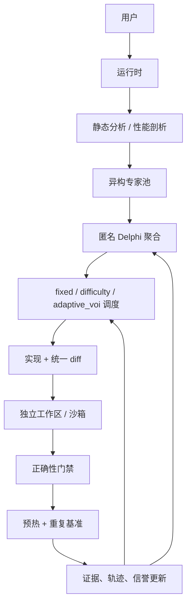

# DelphiOpt

**面向预算感知的自主代码优化的自适应 Delphi 多智能体运行时**

[English](README.en.md) | **简体中文**

DelphiOpt 能找出可度量的 Python 性能改进，并且只回写那些通过了正确性门禁与重复性能门禁的改动。运行一条命令，检视生成的 diff；使用 `--dry-run` 则源码完全不被改动。

> 我们研究在成本、Token、时延与工具预算的约束下，独立的匿名反馈与自适应推理资源分配能否提升「经核验的优化效用」。所有结果均由实际运行产出；本仓库不主张达到最先进（SOTA）水平。

## 为什么这不是普通的多智能体辩论

第 1 轮绝不会向任何智能体暴露同伴的答案。算法、编译器、系统、内存与怀疑者（skeptic）专家基于同一份静态证据各自独立分析。从第 2 轮起，智能体才会收到匿名的候选摘要，以及观测到的测试／基准证据。高上限的少数派假设仍有机会进入实验环节；共识不被当作证明。

## 架构



核心模块：

- `models.py` —— 类型化的提案、决策、预算、基准结果与摘要。
- `providers.py` —— 与提供方无关的异步接口，外加 Mock、OpenAI、Anthropic、Gemini 以及 OpenAI 兼容的 REST 提供方。
- `agents.py` —— 结构化 JSON 提案校验与人格提示词（persona prompt）。
- `delphi.py` —— 独立征询、匿名聚合、少数派保留、分歧度量。
- `scheduler.py` —— `fixed`、`difficulty` 与 `adaptive_voi` 三种策略，且决策可解释。
- `budget.py` —— 唯一的全局成本／Token／时延／LLM／工具／基准账本。
- `optimizer.py` —— 经校验的统一 diff 应用、原子化的已接受文件同步，以及编译／lint／测试门禁。
- `benchmark.py` —— 受预算约束的预热、重复、内存、吞吐量，以及 median／mean／stddev／95% 区间。
- `runtime.py` —— 闭环编排与经核验的接受／拒绝决策。
- `telemetry.py` 与 `reporting.py` —— JSONL／SQLite 轨迹与证据丰富的 HTML 报告；`cli.py` —— 运维命令行。

## 安装与首次运行

需要 Python 3.11+。

```powershell
cd DelphiOpt
python -m pip install -e ".[dev]"
delphiopt optimize .
```

内置的 Mock Provider 无需 API Key。对于一个含有 `tests/`（或 `tests.py`）与 `benchmark.py` 的项目，默认命令会自动识别项目、对基准做剖析、运行配置好的测试，并打印一份 JSON 摘要，其中包含已接受 diff 的路径、正确性、加速比、置信区间、成本与运行 ID。

## 快速开始

```powershell
delphiopt optimize examples/demo_project
# 与 PATH 无关的等价写法：
python -m delphiopt optimize examples/demo_project

# 不调用模型，仅检视热点
delphiopt optimize examples/demo_project --only-analyze

# 验证候选方案，同时保持源码文件不变
delphiopt optimize examples/demo_project --dry-run --max-files 2 --budget-usd 0.50
# 在写入已验证补丁前先询问
delphiopt optimize examples/demo_project --confirm
```

示例项目中含有一个刻意写慢的列表成员判断热循环。DelphiOpt 会运行基线测试与基准，征询五个专家提案，对候选排序，在临时副本中应用「改为集合成员判断」的补丁，重跑正确性测试与重复性能测试，并且只在证据门禁通过之后才把补丁复制回来。

### 一分钟终端演示

```text
$ delphiopt optimize examples/demo_project
status: accepted
correctness: true
baseline_ms: <measured>  ->  best_ms: <measured>
speedup: <verified by interleaved repeated benchmark samples>
diff: .delphiopt/runs/<RUN_ID>/patches/<PROPOSAL_ID>.diff
```

默认的项目探测器会使用 `tests.py`、`tests/` 包、`pyproject.toml`、`setup.cfg` 或 `tox.ini` 来决定测试命令。它还会发现 `benchmark.py`、`benchmarks/benchmark.py`，或第一个 `benchmarks/benchmark_*.py`；`delphiopt.yaml` 中的项目专属命令始终优先。

常用命令：

```powershell
delphiopt benchmark examples/demo_project
delphiopt inspect RUN_ID
delphiopt report RUN_ID
delphiopt reproduce RUN_ID
delphiopt models
delphiopt models --check
delphiopt resume RUN_ID
delphiopt experts
```

`RUN_ID` 会打印在优化输出的 JSON 中，轨迹位于 `examples/demo_project/.delphiopt/runs/` 下。每次运行还会写入一份原子化的 `RUN_ID.checkpoint.json`；如果进程被中断，可用 `delphiopt resume RUN_ID` 续跑（在其他目录运行时，同时传入 `--project` 与 `--runs-root`）。`models --check` 会并发探测已配置的端点，并报告配置、可达性与结构化响应支持情况。

## 配置

```yaml
models:
  cheap: {provider: mock, model: mock-cheap}
  strong: {provider: mock, model: mock-strong}
experts:
  algorithm: {persona: Algorithm Expert, model_pool: [cheap, strong]}
  skeptic: {persona: Skeptic Agent, model_pool: [strong]}
scheduler: {strategy: adaptive_voi, base_tokens: 900, tool_budget: 2}
collaboration: {mode: delphi}
budget:
  max_cost_usd: 1.0
  max_tokens: 150000
  max_latency_seconds: 900
  max_llm_calls: 30
  max_benchmark_runs: 20
delphi: {max_rounds: 3, meaningful_speedup: 1.05}
benchmark: {warmups: 2, repetitions: 5, timeout_seconds: 120}
sandbox: {type: local, network: false, cpu_limit: 2, memory_mb: 2048}
```

配置优先级为：默认值 → 项目内的 `delphiopt.yaml` → 显式 `--config` → 命令行参数。合并操作会深拷贝状态、校验预算为正数、拒绝未知模型，并保留项目的测试／基准命令。最终的覆盖项可以使用 `--budget-usd`、`--max-rounds`、`--mode single|debate|delphi`、`--dry-run`、`--confirm`、`--only-analyze` 与 `--max-files`。使用真实提供方时，需设置 `OPENAI_API_KEY`、`ANTHROPIC_API_KEY` 或 `GEMINI_API_KEY`；参见 `configs/real-providers.yaml.example`。提供方会计入上报的 Token 用量，对瞬时 HTTP 失败以指数退避重试，并可在优化运行前用 `models --check` 做检查。

## 协议与调度

候选评分对共识度、预期收益、置信度、新颖性、信誉、实现成本与正确性风险使用可配置的权重。少数派保留奖励会作用于那些看起来合理、上限较高且正确性风险较低的候选。信誉跨运行持久化在 `.delphiopt/reputation.json` 中，同时维护总体可靠性以及按专家／领域划分的可靠性；其依据是 Brier 分数、校准误差、预测误差、正确性保持与观测到的加速比，而不是仅凭成功次数。

自适应 VOI 使用：

```text
VOI(expert) = disagreement
              × reliability
              × candidate_gain
              × remaining_budget_ratio
              ÷ estimated_cost
```

调度器会为每一次调用记录评分与理由。即使某个局部调度决策请求了更多工作量，全局 `BudgetManager` 依然是最终权威。

## 优化与证据闭环

1. 对项目做快照，并收集轻量级的 AST 证据。
2. 运行基线正确性测试与重复基准。
3. 征询独立的专家提案，并校验 JSON schema 字段。
4. 匿名聚合，并保留少数派候选。
5. 在一个全新的工作区中，应用一份经校验的、由 LLM 提供的统一 diff——或确定性的演示变换——并持久化候选 diff。
6. 运行编译、可选的 lint、可选的类型检查以及配置好的测试；正确性失败则阻止基准执行。
7. 运行预热、随机交错的基线／候选采样、MAD 离群值过滤、bootstrap 置信区间、可选的 CPU 亲和性与环境信息采集；要求 median 加速比、保守的置信区间加速比与变异系数稳定性三者同时达标。
8. 记录真实的正确性、加速比、方差、错误、成本、时延与原始采样，并把这份证据喂给下一轮 Delphi。
9. 仅当正确性通过、且配置的有意义加速比与稳定性均达标时才接受；否则拒绝，并把证据保留在轨迹中。

任何带有测试命令与基准命令的 Python 项目都可以被配置：

```yaml
project:
  test_command: pytest -q
  benchmark_command: python benchmark.py
```

`benchmarks/tasks/` 下的三十个彼此不同的 fixture，覆盖了算法、循环不变量、数据结构、字符串处理、数值计算、内存分配、I/O、序列化、并发与缓存。每个 fixture 都带有专门的基线代码、正确性测试、基准负载、元数据，以及已知的优化机会。`benchmarks/generate_tasks.py` 可复现该数据集；测量值在运行时由命令生成。三个可直接运行的用例是：

- `examples/demo_project` —— 请求式列表成员判断热循环；预期接受「改为集合」的转换。
- `benchmarks/tasks/07-io` —— 重复的记录解析与 I/O 负载，带正确性检查。
- `benchmarks/tasks/10-caching` —— 重复计算与缓存局部性负载。

每个用例都把源码、测试、基准与元数据放在一起，因此结果可以从一份干净的检出中复现。

对于内置 fixture 之外的项目，以下三个真实仓库是文档化的集成目标：

| 项目 | 正确性入口 | 性能负载 |
| --- | --- | --- |
| [`python/pyperformance`](https://github.com/python/pyperformance) | 项目测试命令 | `pyperformance` 基准适配器 |
| [`psf/pyperf`](https://github.com/psf/pyperf) | 项目测试命令 | 经校准的 `pyperf` 适配器 |
| [`psf/requests`](https://github.com/psf/requests) | `python -m pytest -q` | 本地无网络的请求构造适配器 |

确切的命令与适配器契约见 [`docs/real_project_cases.md`](docs/real_project_cases.md)。外部仓库与真实提供方的测量结果，始终与内置的 Mock Provider 套件分开存放。

运行 CI 回归检查器；它验证运行时不变量，而不是产出性能指标：

```powershell
python -m analysis.regression
python -m analysis.regression --fixtures 5 --placebo-limit 8
```

该检查器会验证默认配置可通过校验、隐藏证据门禁已启用、静态上下文不会接触 `hidden/` 文件名、fixture 能在预算上限内端到端运行、固定随机种子能复现相同提案路径，以及在 placebo 卡片上字节完全相同的候选不会被认证为改进。它会将通过／失败报告写入 `analysis/regression_report.json`，任何失败都会以非零状态退出；并且刻意不输出加速比、成本或成功率汇总。

## 协作模式与消融实验

同一套运行时支持：

- `single` —— 单个强算法专家。
- `best_of_n` —— 由数量有界的同构智能体各自独立提出算法方案；只有经核验的最优候选才可能被接受。
- `debate` —— 同伴的提案摘要对后续智能体可见。
- `delphi` —— 第 1 轮独立，之后为匿名受控反馈与修订。

这些条件之间的比较属于 `research/` 下的预注册协议，而不是 `analysis/`。`analysis/run_ablation.py`、`analysis/summarize_results.py` 与 `analysis/render_charts.py` 已有意移除：它们曾在单个示例项目上运行 Mock Provider，并发布加速比、成本、多样性、信誉与收敛表格。由于 Mock 提案是模板文本，这些表格无法支撑实证结论，而且容易被误引。论文中的比较必须来自 `research/` 下按固定协议、随机种子与预算记录的运行。

## 轨迹与报告

每次运行都会记录：运行 ID、轮次、匿名专家身份、实际选用的模型／提供方、已分配与已使用的 Token、成本、时延、提案、VOI、调度理由、持久化的补丁／diff、正确性各阶段的结果、基准采样、保守加速比、候选决策、预算状态与信誉。JSONL 便于人工检视；SQLite 便于程序化分析。`delphiopt report` 会输出一条可检索的证据时间线与指标摘要。

## Windows 桌面控制平面

Windows 桌面应用在不替换后端的前提下，暴露了完整的运行时。前端为全中文，并以真实的 CLI／运行时作为其执行层。它可以启动优化与基准、选择全部协作与调度模式、运行机制回归自检、浏览轨迹、生成并打开报告、复现此前的运行、导出所选运行的摘要、列出模型与专家，并展示提供方就绪状态。所有工作都在后台线程中执行，实时输出面板报告的是真实的后端结果。

**高级设置** 页面提供以下可编辑控件：

- 预算：成本、Token、时延、模型调用次数、基准运行次数与工具调用次数；
- 调度器：fixed／difficulty／adaptive-VOI 策略、基础 Token、每轮工具预算，以及有界的 Best-of-N 并行度（`max_parallel`）；
- Delphi 策略：轮数、分歧阈值、有意义加速比、变异系数、边际收益、效用、无改进即停止，以及少数派奖励；
- 基准：预热次数、重复次数、超时，以及项目的测试／基准／lint 命令；
- 沙箱：本地或 Docker 模式、网络开关、CPU／内存上限与镜像；
- 随机种子、economy／balanced／deep 三档预设、面向模型／专家／提供方／候选权重字段的原始 YAML 编辑、配置校验、项目预检、项目与配置偏好的持久化、控制台复制／清空、自动打开报告，以及打开运行目录。

**模型接入** 页签可以添加 OpenAI、OpenAI 兼容、Anthropic、Gemini 或 mock 模型，并分别为其设置端点 URL、模型标识、API Key 环境变量、超时与 Token 单价。在桌面表单中输入的 API Key 只保留在当前进程内。每个模型都可以在使用前通过一次真实请求进行测试。无需拖拽的 **上移/下移** 控件用于定义优先级顺序；当优先级与故障转移启用时，运行时会按该顺序依次尝试模型，直到有一个返回有效提案。

Best-of-N 的专家请求使用由 `scheduler.max_parallel` 控制的有界并发（默认 `4`），因此独立提案可以降低墙钟时延，同时不会绕过全局预算账本。

从源码运行：

    python frontend/delphiopt_desktop.py

构建独立的 Windows 可执行文件：

    powershell -NoProfile -ExecutionPolicy Bypass -File frontend/build_exe.ps1

交付产物是 dist/DelphiOpt.exe。它内嵌了 Python 运行时、DelphiOpt 包、示例项目、配置、文档与分析辅助脚本；无需另行安装 Python。首次启动时，示例项目会被复制到 %USERPROFILE%\DelphiOpt\demo_project。API Key 只从环境变量读取。

## 研究问题

- **RQ1：** 在代码优化任务上，Delphi 式的匿名反馈是否优于直接的多智能体辩论？
- **RQ2：** 异构模型专家是否比同构智能体产生更有用的提案多样性？
- **RQ3：** 自适应的模型与 Token 调度能否在不牺牲优化成功率的前提下降低成本？
- **RQ4：** 专家信誉能否改善提案排序？
- **RQ5：** 保留少数派的高上限假设是否有益？
- **RQ6：** 一个自主优化系统应当在何时停止花费额外的推理预算？

推荐的指标包括：优化成功率、正确性保持、median 与几何平均加速比、LLM 成本、Token、时延、调用次数、基准运行次数、收敛所需轮数、校准、提案多样性、每次成功优化的成本，以及每美元经核验的加速比。

## 测试与 CI

```powershell
python -m pytest --cov=delphiopt --cov-report=term-missing --cov-fail-under=80 -q
python -m ruff check src tests analysis benchmarks/generate_tasks.py
python -m mypy src
```

GitHub Actions 会运行同样的 lint、类型检查与带覆盖率门禁的测试命令。测试套件覆盖了 Delphi 聚合、收敛／停止、少数派保留、全局预算核算、全部调度器与 VOI、按领域持久化的信誉、提供方响应结构、基准统计、经校验的统一 diff、正确性门禁、沙箱选择、轨迹／报告、CLI，以及端到端经核验的优化。当前实测覆盖率高于要求的 80% 门槛。

## 安全性与局限

候选都在独立的临时副本中运行。`LocalSandbox` 在宿主机上执行命令，并在命令超时时终止所启动的进程树。当 Docker 可用时，`DockerSandbox` 提供禁用网络、限制 CPU／内存的执行路径。

在把已接受的补丁复制回来之前，DelphiOpt 会检查每个目标文件是否仍与候选评估时所用的快照一致。运行期间被编辑过的文件会保持原样；多文件复制若部分失败，则会恢复原始字节。

运行时使用可解释的 VOI 策略，以及用于测试的确定性 Mock Provider。任意变换都需要由所配置的模型给出上下文正确的统一 diff。`DynamicProfiler` 会在 `cProfile` 与 `tracemalloc` 下运行 Python 基准脚本，记录峰值内存，并对 CPU、内存、I/O 与锁相关的热点做分类；基准输出还可以补充实测的内存值。

## 路线图

学习型／上下文赌博机（contextual bandit）调度；贝叶斯 VOI；更丰富的隐藏负载；Docker 编排；分布式执行；更多语言与 CUDA；仪表盘可视化；以及使用真实提供方凭据的更大规模公开基准研究。

## 引用

这是一个软件研究原型。如果你使用了它，请引用本仓库，并报告确切的运行配置、提供方、模型、提交哈希、硬件、随机种子、基准命令与生成的轨迹。本 README 中不嵌入任何实验数字。
