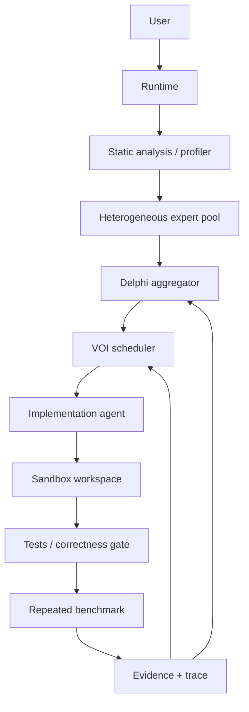

# DelphiOpt architecture

DelphiOpt is an evidence-first optimization loop. The runtime keeps every candidate in an isolated copy and accepts a patch only after the correctness gate and repeated benchmark agree.

The core modules are deliberately small: `models.py` contains typed state, `providers.py` isolates model APIs, `agents.py` validates structured proposals, `delphi.py` handles anonymous aggregation and minority preservation, `scheduler.py` implements fixed/difficulty/VOI policies, `budget.py` enforces one global ledger, and `runtime.py` owns the closed loop.

## State and invariants

* Round one is independent: no peer proposal is placed in the prompt.
* Aggregation groups normalized transformations anonymously and uses reputation-weighted scoring.
* A minority proposal can survive when upside and plausibility compensate for low support.
* A correctness failure never enters performance ranking.
* A patch is copied back only when repeated evidence passes the configured meaningful-speedup and variance gates.
* Every model call, scheduling decision, patch, test, benchmark, candidate decision, and reputation update is JSONL-traced and mirrored to SQLite.

